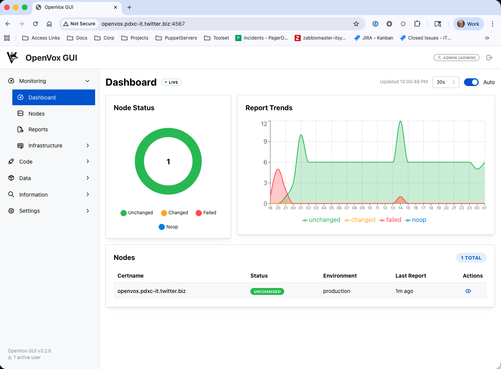
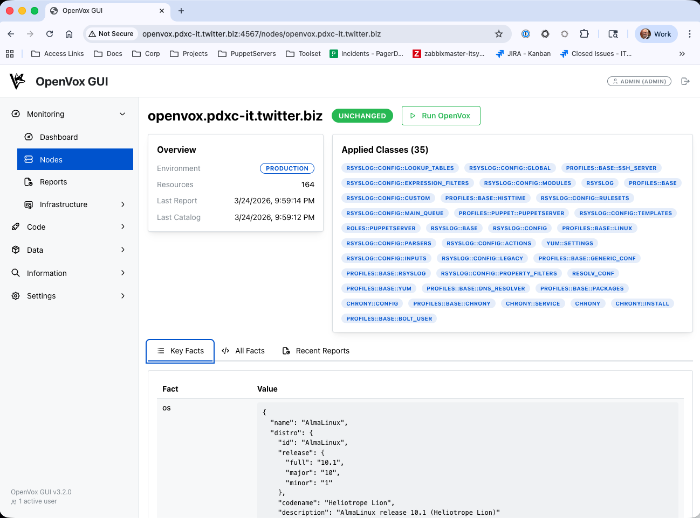
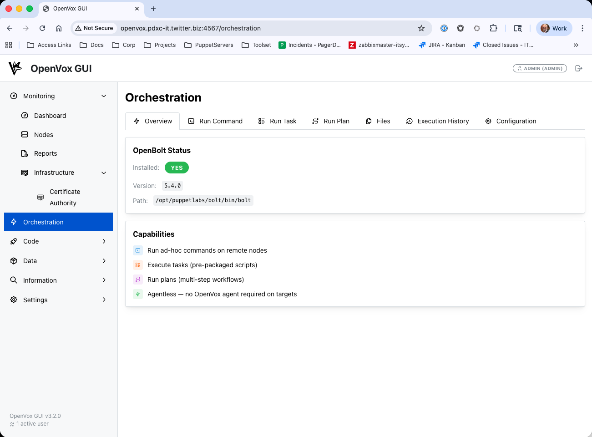
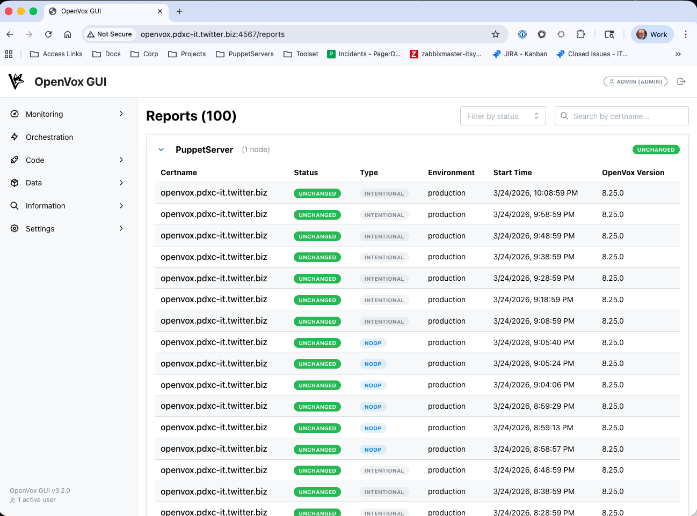
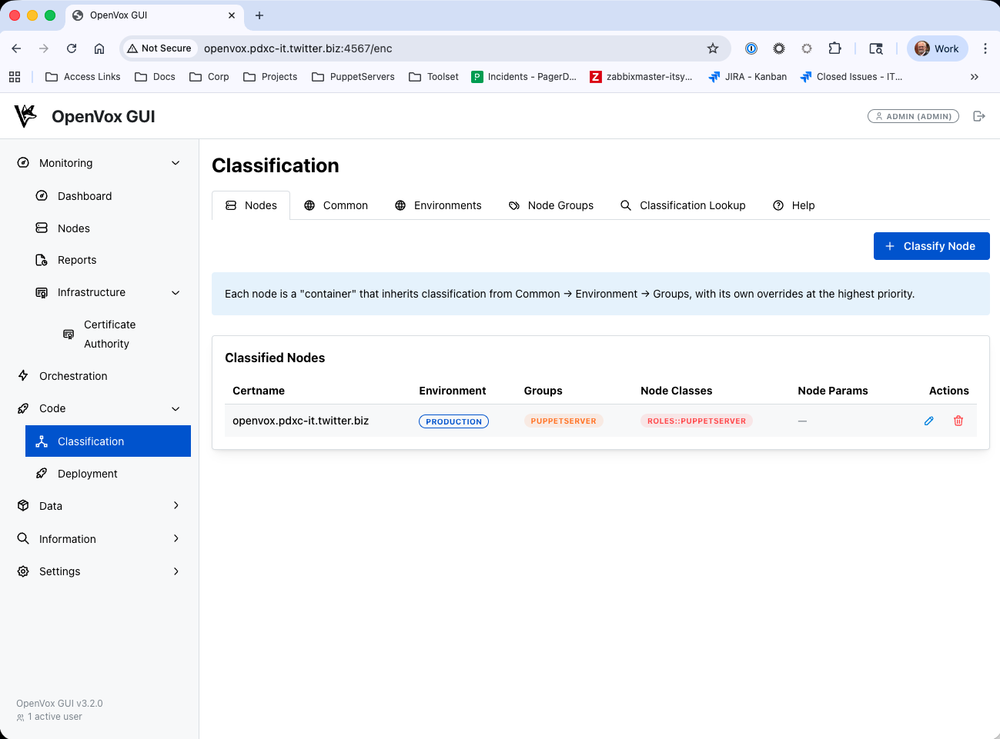
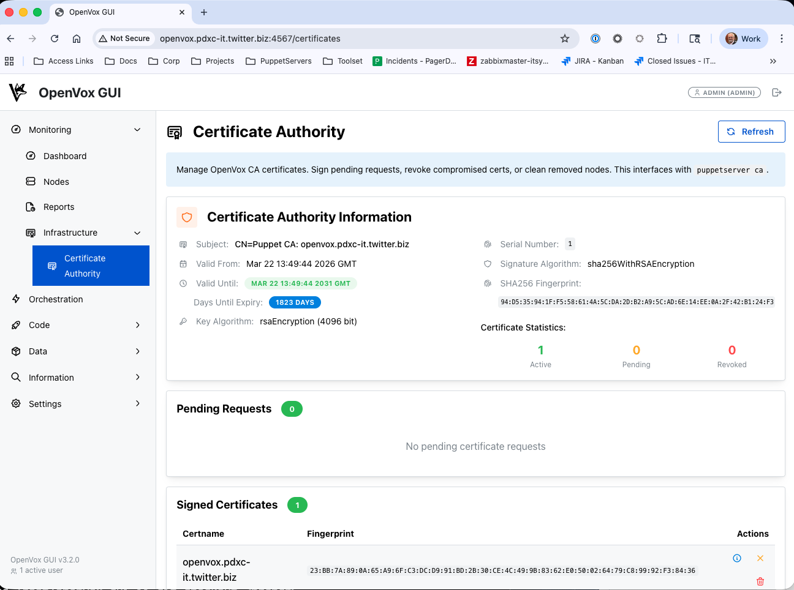
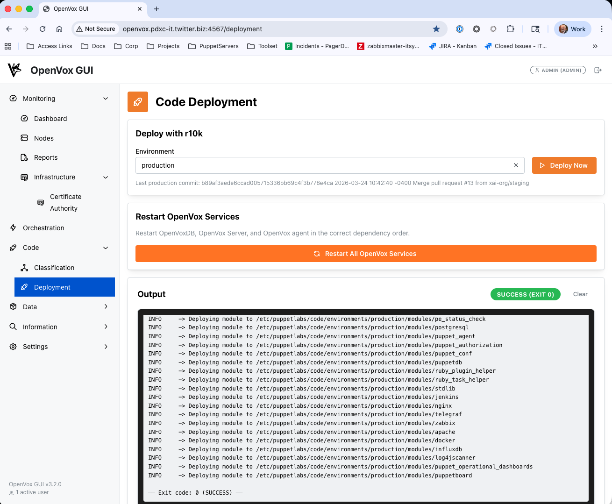
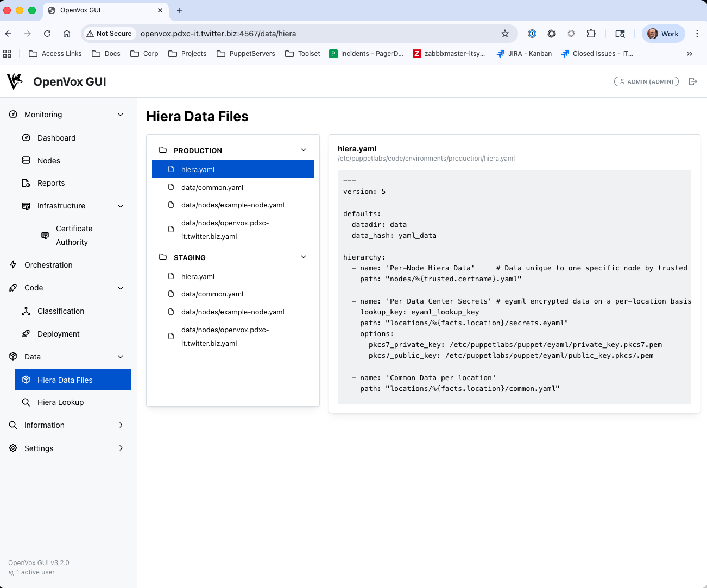
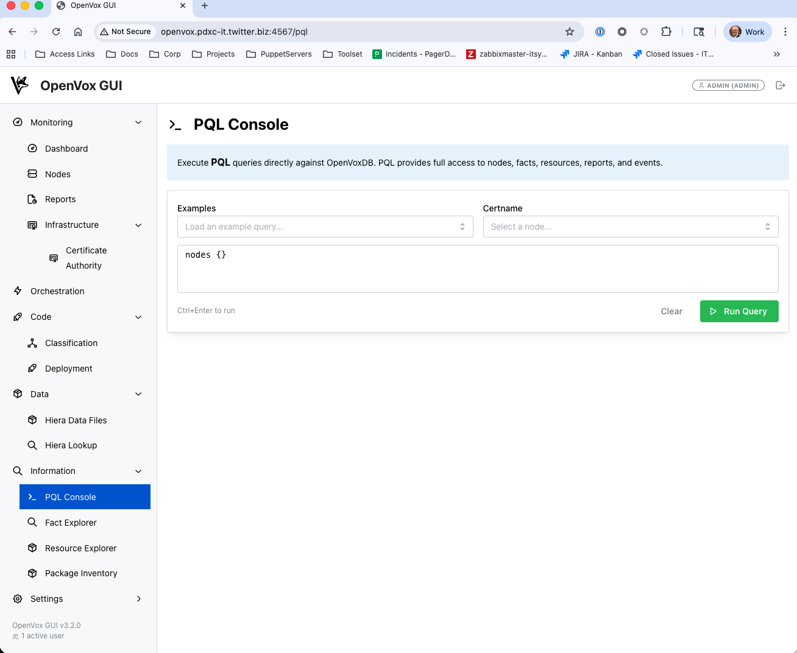

# 📸 Screenshots

All screenshots of OpenVox GUI features.

[← Back to README](README.md)

---

## Gallery

| Dashboard | Node Details | Orchestration |
|-----------|--------------|---------------|
|  |  |  |

| Reports | Classifier | Certificates |
|---------|------------|--------------|
|  |  |  |

| Deployment | Hiera | Data Tools |
|------------|-------|------------|
|  |  |  |

---

[← Back to README](README.md)
